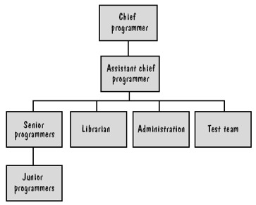

# Chapter3: Planning and Managing the Project

## 1.什么是项目进度，活动，里程碑？

- 项目进度：对特定项目的软件开发周期的刻画，包括对项目阶段、步骤、活动的分解，对每个活动的交互关系的描述，以及对各活动完成时间及整个项目完成时间的初步估算。（通过列举项目的各个阶段，把每个阶段分解成离散的任务或活动，来描述项目的软件开发周期。）
- 活动：项目中的一部分，一般占用项目进度计划的一段时间。
- 里程碑：指特定的时间点，标志着活动的结束，通常伴随着提交物。

## 2.软件人员应该具备的素质

- 完成工作的能力
- 对工作的兴趣
- 开发类似应用程序的经验
- 使用类似工具或语言的经验
- 使用类似技术的经验
- 使用类似开发环境的经验、培训
- 与他人交流的能力
- 与他人共同承担责任的能力
- 管理能力

## 3.软件项目组织的基本结构

- 主程序员：总体负责系统的设计和开发，其他小组成员向主程序员汇报，主程序员对每个决定由最终决策权。
- 副程序员（主程序员助理）：在必要的时候代替主程序员。
- 在具有高度确定性，稳定性，一致性和重复性的项目中，使用像主程序员负责制这样的等级㢟形式会更有效。在项目中涉及大量的不确定性，采用更为民主的方法可能会更有效。
- 忘我方法：不是把责任放在单个人身上，而是让每个人平等的承担责任。过程与个人是分开的。批评是针对产品或结果的，不涉及个人。忘我小组结构是民主的，不论讨论的是设计问题还是测试技术，小组成员投票产生决策。

## 4.专家估算法、算式估算法的大概含义

- 专家估算法：工作量的估计方法依靠的是专家的判断，预测的准确性是给予估计者的能力经验客观性和洞察力。
  - 主要类推法：Delphi技术、Wolwerton模型（该模型的缺点是受变化和主观性的影响，还受当前数据相关性的影响）

- 算式估算：
  - 基本公式：E=（a+b*S^c）m(X)

  *注：* ***S***是估算的系统规模，而 ***a,b***和 ***c***是常量。 ***X***是从 ***x1***到 ***x2***的一个成本因素。而 ***m***是基于这些因素的一个调整因子。

- Walston&Felix模型

  - E=5.25^0.31m(X)

- Bailey&Basili模型
  - E=(5.5+0.73*S^1.46)m(X)

## 5.COCOMO模型的三个基本阶段的工作原理或含义

- 在阶段一中，项目通常构建原型以解决涉及用户接口、软件和系统交互、性能和技术成熟性等方面的高风险事项。人们对最终的产品可能规模知之甚少，此时COMO模型应用点来估计规模。
- 在阶段二中，即早期设计阶段中，已经进行了一个决策以推动开发，但是设计人员必须仔细研究备选的体系结构和操作概念，这是仍然没有足够的信息来支持条例清楚的工作量和持续时间估计。采用功能点作为对规模的估计。
- 在阶段三中，是后体系结构阶段，开发已经开始，而且已经知道了更多的信息。这时可以用功能点或代码行数来表述，而对许多的成本因素可以较为容易的进行估计了。

## 6.什么是风险，几种降低风险的策略

- 风险：在软件生产过程中不希望看到的。有负面结果的事件。
- 策略：
  - 1.通过改变性能和功能需求，避免风险
  - 2.通过把风险分配到其他系统中，或者购买保险以便在风险成为事实时能弥补经济上的损失，从而转移风险。
  - 假设风险会发生，接受并用项目资源控制风险。

有错误或者遗漏？[前往修改](https://github.com/YangDejie/SE/edit/master/chapter3.md)